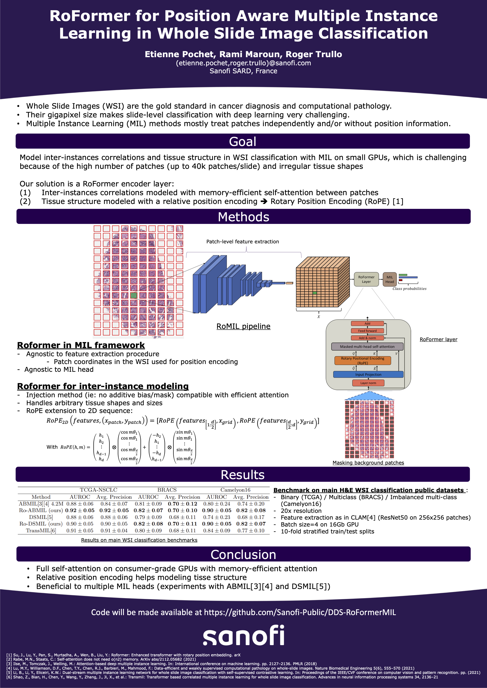

# Code for RoFormer-MIL
MICCAI - MLMI 2023: "RoFormer for Position Aware Multiple Instance Learning in Whole Slide Image Classification" 

[Arxiv](https://arxiv.org/abs/2310.01924)


## Setup 
```sh
source setup.sh
```

To install `miniconda`, `torch==2.0` and other packages.


## Pre-processing
Data should be stored according to their classes

```
└- data
    |
    |- Class 1
    |  |- Image1.svs
    |  |- Image2.svs
    |  └ ...
    |
    └- Class 2
       |- Image1.svs
       |- Image2.svs
       └- ...
```

Pre-processing can be run with 
```sh
python scripts/preprocessing_pipeline.py
python scripts/new_create_splits.py
```

- `scripts/preprocessing_pipeline.py` will run the CLAM preprocessing to tile the slides and extract resnet50 features. Data folder and some parameters can be set in `conf/preprocessing.yaml`.
- `scripts/new_create_splits.py` will run stratified train/test splitting. Parameters can be set in  `conf/create_splits.yaml`.


## Training

### Code relies on 

[PyTorch Lightning](https://lightning.ai/docs/pytorch/stable/) - for boilerplate deep learning code/metrics 

[Hydra](https://hydra.cc/docs/intro/) - for configuration files management

[xFormers](https://github.com/facebookresearch/xformers) - memory efficient attention

### Modeling code
- Model parameters can be set in `conf/model_dict.yaml` 
- Training hyperparameters can be set in `conf/training.yaml`
- Modeling code is found in `romil/models`

```sh 
python scripts/train.py
```
Will trigger a training run on the K folds, leveraging pytorch-lightning for boilerplate code, and mlflow for experiment tracking (easily configurable in `conf/training.yaml`:`training_args.trainer.logger`)

## Reference
If you find our work useful in your research please consider citing our [paper]([https://www.nature.com/articles/s41551-020-00682-w](https://link.springer.com/chapter/10.1007/978-3-031-45676-3_44)):

Pochet, E., Maroun, R., Trullo, R. RoFormer for Position Aware Multiple Instance Learning in Whole Slide Image Classification. Machine Learning in Medical Imaging. MLMI 2023.

```
@InProceedings{pochetroformer23,
author="Pochet, Etienne
and Maroun, Rami
and Trullo, Roger",
title="RoFormer for Position Aware Multiple Instance Learning in Whole Slide Image Classification",
booktitle="Machine Learning in Medical Imaging",
year="2024",
}
```
